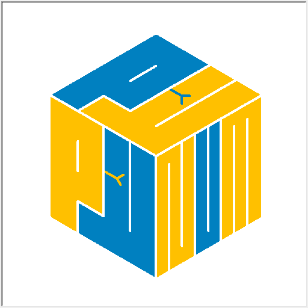

# <font color = blue>PyPyNum</font>

<font color = gree>PyPyNum is a Python library for math & science computations, covering algebra, calculus, stats, with
data structures like matrices, vectors, tensors. It offers numerical tools, programs, and supports computational ops,
functions, processing, simulation, & visualization in data science & ML, crucial for research, engineering, & data
processing.</font><font color = red>[Python>=3.4]</font>

```
 ________   ___    ___  ________   ___    ___  ________    ___  ___   _____ ______
|\   __  \ |\  \  /  /||\   __  \ |\  \  /  /||\   ___  \ |\  \|\  \ |\   _ \  _   \
\ \  \|\  \\ \  \/  / /\ \  \|\  \\ \  \/  / /\ \  \\ \  \\ \  \\\  \\ \  \\\__\ \  \
 \ \   ____\\ \    / /  \ \   ____\\ \    / /  \ \  \\ \  \\ \  \\\  \\ \  \\|__| \  \
  \ \  \___| \/  /  /    \ \  \___| \/  /  /    \ \  \\ \  \\ \  \\\  \\ \  \    \ \  \
   \ \__\  __/  / /       \ \__\  __/  / /       \ \__\\ \__\\ \_______\\ \__\    \ \__\
    \|__| |\___/ /         \|__| |\___/ /         \|__| \|__| \|_______| \|__|     \|__|
          \|___|/                \|___|/
```

[](https://pepy.tech/project/pypynum)
[](https://pepy.tech/project/pypynum)
[](https://pepy.tech/project/pypynum)

## Version -> 1.17.0 | PyPI -> https://pypi.org/project/PyPyNum/ | Gitee -> https://www.gitee.com/PythonSJL/PyPyNum | GitHub -> https://github.com/PythonSJL/PyPyNum



The logo cannot be displayed on PyPI, it can be viewed in Gitee or GitHub.

### Introduction

+ Multi functional math library, similar to numpy, scipy, etc., designed specifically for PyPy interpreters and also
  supports other types of Python interpreters
+ Update versions periodically to add more practical features
+ If you need to contact, please add QQ number 2261748025 (Py𝙿𝚢𝚝𝚑𝚘𝚗-水晶兰), or through my email 2261748025@qq.com

```
+++++++++++++++++++++++++++++++++++++++++
+ Tip:                                  +
+ Have suggestions or feature requests? +
+ Feel free to share them with us.      +
+ Your feedback is highly appreciated!  +
+++++++++++++++++++++++++++++++++++++++++
```

### Copyright and License

This Python library is licensed under the GNU Affero General Public License version 3 (AGPLv3).

The license is designed to ensure that network server software is made available to the community, allowing users to
access the source code of modified versions when the software is used to provide network services.

**Key Terms and Conditions:**

- Source Code: The library must be provided with its source code, and any modifications must also be distributed under
  the AGPLv3.
- Free Redistribution: The library can be distributed in source and binary forms without any restrictions.
- No Discrimination: The license does not restrict the use of the software by individuals or organizations, nor does it
  discriminate against fields of use.
- No Discrimination Against Persons or Groups: The license does not restrict anyone from receiving the software.
- Patent License: The patent holder must grant a patent license to anyone who uses the software.
- No Surrender of Others' Freedom: The license does not allow any conditions that contradict the AGPLv3.
- Remote Network Interaction: If the software can interact with users remotely, the source code must be made available
  at no charge.
- Revised Versions of this License: The Free Software Foundation may publish revised versions of the AGPLv3, and users
  have the option to follow the terms of any version.
- Disclaimer of Warranty: There is no warranty for the software, to the extent permitted by applicable law.
- Limitation of Liability: The copyright holder and any other party who modifies and conveys the software are not liable
  for damages arising from the use or inability to use the software.

**Full License Text:**

[GNU Affero General Public License](https://www.gnu.org/licenses/agpl-3.0.en.html)

### Name and Function Introduction of Submodules

|   Submodule Name    |                       Function Introduction                        |
|:-------------------:|:------------------------------------------------------------------:|
|  `pypynum.arrays`   | Provides operations and calculations for multi-dimensional arrays. |
|   `pypynum.chars`   |       Contains a variety of special mathematical characters.       |
|  `pypynum.ciphers`  |      Implements various encryption and decryption algorithms.      |
|  `pypynum.consts`   |           Contains mathematical and physical constants.            |
|  `pypynum.crandom`  |                 Generates random complex numbers.                  |
| `pypynum.dataproc`  |          Tools for data preprocessing and transformation.          |
|   `pypynum.dists`   |    Statistical distribution functions and related calculations.    |
| `pypynum.equations` |         Solves equations and performs symbolic operations.         |
|    `pypynum.fft`    |  Implements Fast Fourier Transforms and related functionalities.   |
|   `pypynum.files`   |                  File reading and writing tools.                   |
|   `pypynum.geoms`   |             Geometric shapes and calculation methods.              |
|  `pypynum.graphs`   |           Graph theory algorithms and network analysis.            |
|  `pypynum.groups`   |         Group theory calculations and structural analysis.         |
| `pypynum.hypcmpnms` |        Hypercomplex number operations and transformations.         |
|  `pypynum.images`   |              Image processing and manipulation tools.              |
|  `pypynum.interp`   |         Interpolation methods and function approximation.          |
|  `pypynum.kernels`  |          Implementation of kernel functions and methods.           |
|  `pypynum.logics`   |                    Simulates logical circuits.                     |
|   `pypynum.maths`   |     Basic mathematical operations and commonly used functions.     |
| `pypynum.matrices`  |         Matrix operations and linear algebra calculations.         |
| `pypynum.multiprec` |               High-precision numerical computations.               |
| `pypynum.networks`  |                   Network models and algorithms.                   |
|  `pypynum.numbers`  |           Operations on numerical types and properties.            |
| `pypynum.plotting`  |                     Data visualization tools.                      |
|   `pypynum.polys`   |              Polynomial operations and calculations.               |
| `pypynum.pprinters` |              Advanced printing and formatting output.              |
|  `pypynum.random`   |                Generates arrays of random numbers.                 |
|   `pypynum.regs`    |               Regression analysis and model fitting.               |
|   `pypynum.seqs`    |              Computes various mathematical sequences.              |
|  `pypynum.special`  | Provides advanced special functions for mathematical computations. |
| `pypynum.stattest`  |                Statistical tests and data analysis.                |
|  `pypynum.symbols`  |         Symbolic computation and expression manipulation.          |
|  `pypynum.tensors`  |                Tensor operations and calculations.                 |
|   `pypynum.test`    |                Simple code testing for the library.                |
|   `pypynum.this`    |     The Zen of the library, expressing its guiding principles.     |
|   `pypynum.tools`   |                General tools and helper functions.                 |
|   `pypynum.trees`   |           Tree structures and algorithm implementations.           |
|   `pypynum.types`   |      Contains various types, exceptions, and configurations.       |
|  `pypynum.ufuncs`   |           Universal functions and vectorized operations.           |
|   `pypynum.utils`   |             Utility programs and auxiliary functions.              |
|  `pypynum.vectors`  |                Vector operations and calculations.                 |
|   `pypynum.zh_cn`   | Provides Chinese language interfaces for various functionalities.  |

### The Zen of PyPyNum (Preview)

```
                The Zen of PyPyNum, by Shen Jiayi

In this mathematical sanctuary, we weave our algorithms with pure Python threads.

Precision outweighs approximation.
Elegance in mathematics transcends the bulky algorithms.
Clarity in logic illuminates the darkest problems.
Simplicity in form is the pinnacle of sophistication.
Flat hierarchies in our code mirror the linear nature of functions.
Sparse code, like a minimal polynomial, retains essence without redundancy.
```

```
...

Do you want to view all the content?

Enter "from pypynum import this" in your

Python interpreter and run it!
```

```
                                                                September 5, 2024
```

### Functional Changes Compared to the Previous Version

```
!=!=!=!=!=!=!=!=!=!=!=!=!=!=!=!=!=!=!=!=!=!=!=!=!=!=!=!=!=!=!=!=

The current version has correctly implemented the SVD function
for matrix singular value decomposition

The functions "lower_gamma" and "upper_gamma" have been renamed
to "lowergamma" and "uppergamma", respectively

Rename the submodule "quats" to "hypcmpnms" which means
"hypercomplex numbers"

Fixed calculation errors that existed before the quaternion
class

Fixed the issue caused by name change in the "pprint_matrix"
function

(Of course, other features have also undergone minor
modifications, and the effect may differ from previous versions)

!=!=!=!=!=!=!=!=!=!=!=!=!=!=!=!=!=!=!=!=!=!=!=!=!=!=!=!=!=!=!=!=

The following are newly added functions or classes:

(These functions have been tested multiple times and no issues
have been found so far. If there are any problems, please
contact me promptly.)

!=!=!=!=!=!=!=!=!=!=!=!=!=!=!=!=!=!=!=!=!=!=!=!=!=!=!=!=!=!=!=!=

Octonion(s: typing.Union[int, float], t: typing.Union[int,
float], u: typing.Union[int, float], v: typing.Union[int,
float], w: typing.Union[int, float], x: typing.Union[int,
float], y: typing.Union[int, float], z: typing.Union[int,
float])

This is an octonion class, with many operational functions for
octonions. Octonions are an eight-dimensional extension of
complex numbers, initially introduced by John T. Graves in 1843.
Characterized by their non-associative nature, they consist of
seven imaginary units, denoted as i, j, k, l, m, n, and o. These
entities are applied in physics and computer graphics, albeit
their non-associativity constraint hinders their extensive
computational utilization.

Example:

o = Octonion(1, 2, 3, 4, 5, 6, 7, 8)
o = (1+2i+3j+4k+5l+6m+7n+8o)
o * o = (-202+4i+6j+8k+10l+12m+14n+16o)
round(o.inverse(), 6) = (0.004902-0.009804i-0.014706j-0.019608k-0.02451l-0.029412m-0.034314n-0.039216o)
round(o * o.inverse(), 16) = (1.0+0.0i+0.0j+0.0k+0.0l+0.0m+0.0n-0.0o)
round(o / o, 16) = (1.0+0.0i+0.0j+0.0k+0.0l+0.0m+0.0n-0.0o)

Provides a good function `octo` for creating Octonion classes.

octo(s: real = 0, t: real = 0, u: real = 0, v: real = 0, w: real
= 0, x: real = 0, y: real = 0, z: real = 0) -> Octonion

!=!=!=!=!=!=!=!=!=!=!=!=!=!=!=!=!=!=!=!=!=!=!=!=!=!=!=!=!=!=!=!=

diag_indices(n: <class 'int'>, k: <class 'int'>, m: <class
'int'>) -> <class 'tuple'>

This function computes the indices for the k-th diagonal in an n
x m matrix. It returns a tuple of two tuples, each containing a
sequence of integers representing the row and column indices,
respectively, for the k-th diagonal in the matrix. The first
tuple corresponds to the row indices, and the second to the
column indices. The value of k indicates the diagonal: k=0 for
the main diagonal, k>0 for diagonals above the main diagonal,
and k<0 for diagonals below.

diag(v: typing.Any, k: <class 'int'>, n: <class 'int'>, m:
<class 'int'>) -> typing.Any

This function performs dual operations similar to the NumPy
`diag` function: 1. When `v` is a sequence, it constructs a
diagonal matrix by placing the elements of `v` on the k-th
diagonal. 2. When `v` is a matrix, it extracts the elements from
the k-th diagonal and returns them as a 1D sequence. The
argument `k` specifies the diagonal to be operated on, where k=0
refers to the main diagonal, k>0 identifies diagonals above the
main, and k<0 identifies diagonals below the main diagonal.

!=!=!=!=!=!=!=!=!=!=!=!=!=!=!=!=!=!=!=!=!=!=!=!=!=!=!=!=!=!=!=!=

damerau(x: typing.Union[list, tuple, str], y: typing.Union[list,
tuple, str]) -> <class 'int'>

Calculate the Damerau-Levenshtein
distance between two sequences. The Damerau-Levenshtein distance
is a measure of the difference between two sequences. It is an
extension of the Levenshtein distance that allows transpositions
(i.e., swapping two adjacent characters) to be considered as a
single edit operation. This function supports any type of
iterable sequences, such as strings, lists, or tuples.
Example:
>>> damerau("ensure", "nester")
3

strip_helper(sequence: typing.Any, keys_set: <class 'set'>,
strip_start: <class 'bool'>, strip_end: <class 'bool'>) ->
typing.Any

Removes elements from the start and/or
end of a sequence that match the specified keys.
Example:
>>> strip_helper([1, 2, 3, 4, 5, 1, 2], {1, 2}, True, True)
[3, 4, 5]

strip(sequence: typing.Any, keys: typing.Any) -> typing.Any

Removes elements from both the start and
end of a sequence that match the specified keys.
Example:
>>> strip([1, 2, 3, 4, 5, 1, 2], [1, 2])
[3, 4, 5]

lstrip(sequence: typing.Any, keys: typing.Any) -> typing.Any

Removes elements from the start of a
sequence that match the specified keys.
Example:
>>> lstrip([1, 2, 3, 4, 5, 1, 2], [1, 2])
[3, 4, 5, 1, 2]

rstrip(sequence: typing.Any, keys: typing.Any) -> typing.Any

Removes elements from the end of a
sequence that match the specified keys.
Example:
>>> rstrip([1, 2, 3, 4, 5, 1, 2], [1, 2])
[1, 2, 3, 4, 5]

!=!=!=!=!=!=!=!=!=!=!=!=!=!=!=!=!=!=!=!=!=!=!=!=!=!=!=!=!=!=!=!=
```

### Run Time Test

Python interpreter version

+ CPython 3.8.10

+ PyPy 3.10.12

| Matrix Time Test                               | NumPy+CPython (seconds)                                                                                                                                                            | Ranking | PyPyNum+PyPy (seconds)                                                                                                                                                             | Ranking | Mpmath_+_PyPy_ (seconds)                                                                                                                                                         | Ranking | SymPy_+_PyPy_ (seconds)                                                                                                                                                                                                                    | Ranking |
|------------------------------------------------|------------------------------------------------------------------------------------------------------------------------------------------------------------------------------------|---------|------------------------------------------------------------------------------------------------------------------------------------------------------------------------------------|---------|----------------------------------------------------------------------------------------------------------------------------------------------------------------------------------|---------|--------------------------------------------------------------------------------------------------------------------------------------------------------------------------------------------------------------------------------------------|---------|
| Create a hundred order random number matrix    | 0.000083                                                                                                                                                                           | 1       | 0.005374                                                                                                                                                                           | 2       | 0.075253                                                                                                                                                                         | 3       | 0.230530                                                                                                                                                                                                                                   | 4       |
| Create a thousand order random number matrix   | 0.006740                                                                                                                                                                           | 1       | 0.035666                                                                                                                                                                           | 2       | 1.200950                                                                                                                                                                         | 3       | 4.370265                                                                                                                                                                                                                                   | 4       |
| Addition of matrices of order one hundred      | 0.000029                                                                                                                                                                           | 1       | 0.002163                                                                                                                                                                           | 2       | 0.045641                                                                                                                                                                         | 4       | 0.035700                                                                                                                                                                                                                                   | 3       |
| Adding matrices of order one thousand          | 0.002647                                                                                                                                                                           | 1       | 0.019111                                                                                                                                                                           | 2       | 1.746957                                                                                                                                                                         | 4       | 0.771542                                                                                                                                                                                                                                   | 3       |
| Determinant of a hundred order matrix          | 0.087209                                                                                                                                                                           | 2       | 0.016331                                                                                                                                                                           | 1       | 4.354507                                                                                                                                                                         | 3       | 5.157206                                                                                                                                                                                                                                   | 4       |
| Determinant of a thousand order matrix         | 0.616113                                                                                                                                                                           | 1       | 3.509747                                                                                                                                                                           | 2       | It takes a long time                                                                                                                                                             | 3       | It takes a long time                                                                                                                                                                                                                       | 4       |
| Finding the inverse of a hundred order matrix  | 0.162770                                                                                                                                                                           | 2       | 0.015768                                                                                                                                                                           | 1       | 8.162948                                                                                                                                                                         | 3       | 21.437424                                                                                                                                                                                                                                  | 4       |
| Finding the inverse of a thousand order matrix | 0.598905                                                                                                                                                                           | 1       | 17.072552                                                                                                                                                                          | 2       | It takes a long time                                                                                                                                                             | 3       | It takes a long time                                                                                                                                                                                                                       | 4       |
| Array output effect                            | ```[[[[ -7 -67]```<br>```[-78  29]]```<br><br>```[[-86 -97]```<br>```[ 68  -3]]]```<br><br><br>```[[[ 11  42]```<br>```[ 24 -65]]```<br><br>```[[-60  72]```<br>```[ 73   2]]]]``` | /       | ```[[[[ 37  83]```<br>```[ 40   2]]```<br><br>```[[ -5 -34]```<br>```[ -7  72]]]```<br><br><br>```[[[ 13 -64]```<br>```[  6  90]]```<br><br>```[[ 68  57]```<br>```[ 78  11]]]]``` | /       | ```[-80.0   -8.0  80.0  -88.0]```<br>```[-99.0  -43.0  87.0   81.0]```<br>```[ 20.0  -55.0  98.0    8.0]```<br>```[  8.0   44.0  64.0  -35.0]```<br><br>(Only supports matrices) | /       | ```⎡⎡16   -56⎤  ⎡ 8   -28⎤⎤```<br>```⎢⎢        ⎥  ⎢        ⎥⎥```<br>```⎢⎣-56  56 ⎦  ⎣-28  28 ⎦⎥```<br>```⎢                      ⎥```<br>```⎢ ⎡-2  7 ⎤   ⎡-18  63 ⎤⎥```<br>```⎢ ⎢      ⎥   ⎢        ⎥⎥```<br>```⎣ ⎣7   -7⎦   ⎣63   -63⎦⎦``` | /       |

### Basic Structure

```
PyPyNum
├── arrays
│   ├── CLASS
│   │   ├── Array(object)/__init__(self: Any, data: Any, check: Any) -> Any
│   │   └── BoolArray(pypynum.arrays.Array)/__init__(self: Any, data: Any, check: Any) -> Any
│   └── FUNCTION
│       ├── array(data: Any) -> Any
│       ├── asarray(data: Any) -> Any
│       ├── aslist(data: Any) -> Any
│       ├── boolarray(data: Any) -> Any
│       ├── fill(shape: typing.Union[list, tuple], sequence: typing.Union[list, tuple], repeat: bool, pad: typing.Any, rtype: typing.Callable) -> typing.Any
│       ├── full(shape: typing.Union[list, tuple], fill_value: typing.Any, rtype: typing.Callable) -> typing.Any
│       ├── full_like(a: typing.Any, fill_value: typing.Any, rtype: typing.Callable) -> typing.Any
│       ├── get_shape(data: Any) -> Any
│       ├── is_valid_array(_array: Any, _shape: Any) -> Any
│       ├── ones(shape: typing.Union[list, tuple], rtype: typing.Callable) -> typing.Any
│       ├── ones_like(a: typing.Any, rtype: typing.Callable) -> typing.Any
│       ├── tensorproduct(tensors: pypynum.arrays.Array) -> pypynum.arrays.Array
│       ├── zeros(shape: typing.Union[list, tuple], rtype: typing.Callable) -> typing.Any
│       └── zeros_like(a: typing.Any, rtype: typing.Callable) -> typing.Any
├── chars
│   ├── CLASS
│   └── FUNCTION
│       ├── int2subscript(standard_str: str) -> str
│       ├── int2superscript(standard_str: str) -> str
│       ├── subscript2int(subscript_str: str) -> str
│       └── superscript2int(superscript_str: str) -> str
├── ciphers
│   ├── CLASS
│   └── FUNCTION
│       ├── atbash(text: str) -> str
│       ├── base_64(text: str, decrypt: bool) -> str
│       ├── caesar(text: str, shift: int, decrypt: bool) -> str
│       ├── hill256(text: bytes, key: list, decrypt: bool) -> bytes
│       ├── ksa(key: bytes) -> list
│       ├── morse(text: str, decrypt: bool) -> str
│       ├── playfair(text: str, key: str, decrypt: bool) -> str
│       ├── prga(s: list) -> Any
│       ├── rc4(text: bytes, key: bytes) -> bytes
│       ├── rot13(text: str) -> str
│       ├── substitution(text: str, sub_map: dict, decrypt: bool) -> str
│       └── vigenere(text: str, key: str, decrypt: bool) -> str
├── consts
│   ├── CLASS
│   └── FUNCTION
├── crandom
│   ├── CLASS
│   └── FUNCTION
│       ├── randint_polar(left: int, right: int, mod: typing.Union[int, float], angle: typing.Union[int, float]) -> complex
│       ├── randint_rect(left: int, right: int, real: typing.Union[int, float], imag: typing.Union[int, float]) -> complex
│       ├── random_polar(mod: typing.Union[int, float], angle: typing.Union[int, float]) -> complex
│       ├── random_rect(real: typing.Union[int, float], imag: typing.Union[int, float]) -> complex
│       ├── uniform_polar(left: typing.Union[int, float], right: typing.Union[int, float], mod: typing.Union[int, float], angle: typing.Union[int, float]) -> complex
│       └── uniform_rect(left: typing.Union[int, float], right: typing.Union[int, float], real: typing.Union[int, float], imag: typing.Union[int, float]) -> complex
├── dataproc
│   ├── CLASS
│   │   └── Series(object)/__init__(self: Any, data: typing.Any, index: typing.Any) -> None
│   └── FUNCTION
├── dists
│   ├── CLASS
│   └── FUNCTION
│       ├── beta_pdf(x: Any, a: Any, b: Any) -> Any
│       ├── binom_pmf(k: Any, n: Any, p: Any) -> Any
│       ├── cauchy_cdf(x: Any, x0: Any, gamma: Any) -> Any
│       ├── cauchy_pdf(x: Any, x0: Any, gamma: Any) -> Any
│       ├── chi2_cdf(x: Any, df: Any) -> Any
│       ├── chi2_pdf(x: Any, df: Any) -> Any
│       ├── expon_cdf(x: Any, scale: Any) -> Any
│       ├── expon_pdf(x: Any, scale: Any) -> Any
│       ├── f_pdf(x: Any, dfnum: Any, dfden: Any) -> Any
│       ├── gamma_pdf(x: Any, shape: Any, scale: Any) -> Any
│       ├── geometric_pmf(k: Any, p: Any) -> Any
│       ├── hypergeom_pmf(k: Any, mg: Any, n: Any, nt: Any) -> Any
│       ├── invgauss_pdf(x: Any, mu: Any, lambda_: Any, alpha: Any) -> Any
│       ├── levy_pdf(x: Any, c: Any) -> Any
│       ├── log_logistic_cdf(x: Any, alpha: Any, beta: Any) -> Any
│       ├── log_logistic_pdf(x: Any, alpha: Any, beta: Any) -> Any
│       ├── logistic_cdf(x: Any, mu: Any, s: Any) -> Any
│       ├── logistic_pdf(x: Any, mu: Any, s: Any) -> Any
│       ├── lognorm_cdf(x: Any, mu: Any, sigma: Any) -> Any
│       ├── lognorm_pdf(x: Any, s: Any, scale: Any) -> Any
│       ├── logser_pmf(k: Any, p: Any) -> Any
│       ├── multinomial_pmf(k: Any, n: Any, p: Any) -> Any
│       ├── nbinom_pmf(k: Any, n: Any, p: Any) -> Any
│       ├── nhypergeom_pmf(k: Any, m: Any, n: Any, r: Any) -> Any
│       ├── normal_cdf(x: Any, mu: Any, sigma: Any) -> Any
│       ├── normal_pdf(x: Any, mu: Any, sigma: Any) -> Any
│       ├── pareto_pdf(x: Any, k: Any, m: Any) -> Any
│       ├── poisson_pmf(k: Any, mu: Any) -> Any
│       ├── rayleigh_pdf(x: Any, sigma: Any) -> Any
│       ├── t_pdf(x: Any, df: Any) -> Any
│       ├── uniform_cdf(x: Any, loc: Any, scale: Any) -> Any
│       ├── uniform_pdf(x: Any, loc: Any, scale: Any) -> Any
│       ├── vonmises_pdf(x: Any, mu: Any, kappa: Any) -> Any
│       ├── weibull_max_pdf(x: Any, c: Any, scale: Any, loc: Any) -> Any
│       ├── weibull_min_pdf(x: Any, c: Any, scale: Any, loc: Any) -> Any
│       └── zipf_pmf(k: Any, s: Any, n: Any) -> Any
├── equations
│   ├── CLASS
│   └── FUNCTION
│       ├── lin_eq(left: list, right: list) -> list
│       └── poly_eq(coefficients: list) -> list
├── fft
│   ├── CLASS
│   │   └── FT1D(object)/__init__(self: Any, data: Any) -> Any
│   └── FUNCTION
├── files
│   ├── CLASS
│   └── FUNCTION
│       ├── read(file: str) -> list
│       └── write(file: str, cls: object) -> Any
├── geoms
│   ├── CLASS
│   │   ├── Circle(object)/__init__(self: Any, center: typing.Union[list, tuple], radius: typing.Union[int, float]) -> Any
│   │   ├── Line(object)/__init__(self: Any, a: typing.Union[list, tuple], b: typing.Union[list, tuple]) -> Any
│   │   ├── Point(object)/__init__(self: Any, p: typing.Union[list, tuple]) -> Any
│   │   ├── Polygon(object)/__init__(self: Any, p: typing.Union[list, tuple]) -> Any
│   │   ├── Quadrilateral(object)/__init__(self: Any, a: typing.Union[list, tuple], b: typing.Union[list, tuple], c: typing.Union[list, tuple], d: typing.Union[list, tuple]) -> Any
│   │   └── Triangle(object)/__init__(self: Any, a: typing.Union[list, tuple], b: typing.Union[list, tuple], c: typing.Union[list, tuple]) -> Any
│   └── FUNCTION
│       └── distance(g1: Any, g2: Any, error: typing.Union[int, float]) -> float
├── graphs
│   ├── CLASS
│   │   ├── BaseGraph(object)/__init__(self: Any) -> Any
│   │   ├── BaseWeGraph(pypynum.graphs.BaseGraph)/__init__(self: Any) -> Any
│   │   ├── DiGraph(pypynum.graphs.BaseGraph)/__init__(self: Any) -> Any
│   │   ├── UnGraph(pypynum.graphs.BaseGraph)/__init__(self: Any) -> Any
│   │   ├── WeDiGraph(pypynum.graphs.BaseWeGraph)/__init__(self: Any) -> Any
│   │   └── WeUnGraph(pypynum.graphs.BaseWeGraph)/__init__(self: Any) -> Any
│   └── FUNCTION
├── groups
│   ├── CLASS
│   │   └── Group(object)/__init__(self: Any, data: Any, operation: Any) -> Any
│   └── FUNCTION
│       └── group(data: Any) -> Any
├── hypcmpnms
│   ├── CLASS
│   │   ├── Euler(object)/__init__(self: Any, y: typing.Union[int, float], p: typing.Union[int, float], r: typing.Union[int, float]) -> Any
│   │   ├── Octonion(object)/__init__(self: Any, s: typing.Union[int, float], t: typing.Union[int, float], u: typing.Union[int, float], v: typing.Union[int, float], w: typing.Union[int, float], x: typing.Union[int, float], y: typing.Union[int, float], z: typing.Union[int, float]) -> Any
│   │   └── Quaternion(object)/__init__(self: Any, w: typing.Union[int, float], x: typing.Union[int, float], y: typing.Union[int, float], z: typing.Union[int, float]) -> Any
│   └── FUNCTION
│       ├── convert(data: typing.Union[pypynum.hypcmpnms.Quaternion, pypynum.matrices.Matrix, pypynum.hypcmpnms.Euler], to: str) -> typing.Union[pypynum.hypcmpnms.Quaternion, pypynum.matrices.Matrix, pypynum.hypcmpnms.Euler]
│       ├── euler(yaw: typing.Union[int, float], pitch: typing.Union[int, float], roll: typing.Union[int, float]) -> pypynum.hypcmpnms.Euler
│       ├── octo(s: typing.Union[int, float], t: typing.Union[int, float], u: typing.Union[int, float], v: typing.Union[int, float], w: typing.Union[int, float], x: typing.Union[int, float], y: typing.Union[int, float], z: typing.Union[int, float]) -> pypynum.hypcmpnms.Octonion
│       └── quat(w: typing.Union[int, float], x: typing.Union[int, float], y: typing.Union[int, float], z: typing.Union[int, float]) -> pypynum.hypcmpnms.Quaternion
├── images
│   ├── CLASS
│   │   └── PNG(object)/__init__(self: Any) -> None
│   └── FUNCTION
│       └── crc(data: Any, length: Any, init: Any, xor: Any) -> Any
├── interp
│   ├── CLASS
│   └── FUNCTION
│       ├── bicubic(x: Any) -> Any
│       ├── contribute(src: Any, x: Any, y: Any, channels: Any) -> Any
│       ├── interp1d(data: typing.Union[list, tuple], length: int) -> list
│       └── interp2d(src: Any, new_height: Any, new_width: Any, channels: Any, round_res: Any, min_val: Any, max_val: Any) -> Any
├── kernels
│   ├── CLASS
│   └── FUNCTION
│       ├── det2x2kernel(a: typing.Union[list, tuple]) -> float
│       ├── det3x3kernel(a: typing.Union[list, tuple]) -> float
│       ├── det4x4kernel(a: typing.Union[list, tuple]) -> float
│       ├── eigen2x2kernel(a: typing.Union[list, tuple]) -> tuple
│       ├── inv2x2kernel(a: typing.Union[list, tuple]) -> list
│       ├── inv3x3kernel(a: typing.Union[list, tuple]) -> list
│       ├── inv4x4kernel(a: typing.Union[list, tuple]) -> list
│       ├── lu2x2kernel(a: typing.Union[list, tuple]) -> tuple
│       ├── lu3x3kernel(a: typing.Union[list, tuple]) -> tuple
│       ├── lu4x4kernel(a: typing.Union[list, tuple]) -> tuple
│       ├── matexp2x2kernel(a: typing.Union[list, tuple]) -> list
│       ├── matmul2x2kernel(a: typing.Union[list, tuple], b: typing.Union[list, tuple]) -> list
│       ├── matmul3x3kernel(a: typing.Union[list, tuple], b: typing.Union[list, tuple]) -> list
│       ├── matmul4x4kernel(a: typing.Union[list, tuple], b: typing.Union[list, tuple]) -> list
│       └── matpow2x2kernel(a: typing.Union[list, tuple], n: typing.Union[int, float, complex]) -> list
├── logics
│   ├── CLASS
│   │   ├── AND(pypynum.logics.Binary)/__init__(self: Any, label: Any, pin0: Any, pin1: Any) -> Any
│   │   ├── Basic(object)/__init__(self: Any, label: Any) -> Any
│   │   ├── Binary(pypynum.logics.Basic)/__init__(self: Any, label: Any, pin0: Any, pin1: Any) -> Any
│   │   ├── COMP(pypynum.logics.Binary)/__init__(self: Any, label: Any, pin0: Any, pin1: Any) -> Any
│   │   ├── DFF(pypynum.logics.Unary)/__init__(self: Any, label: Any, pin0: Any, state: Any) -> Any
│   │   ├── FullAdder(pypynum.logics.Ternary)/__init__(self: Any, label: Any, pin0: Any, pin1: Any, pin2: Any) -> Any
│   │   ├── FullSuber(pypynum.logics.Ternary)/__init__(self: Any, label: Any, pin0: Any, pin1: Any, pin2: Any) -> Any
│   │   ├── HalfAdder(pypynum.logics.Binary)/__init__(self: Any, label: Any, pin0: Any, pin1: Any) -> Any
│   │   ├── HalfSuber(pypynum.logics.Binary)/__init__(self: Any, label: Any, pin0: Any, pin1: Any) -> Any
│   │   ├── JKFF(pypynum.logics.Binary)/__init__(self: Any, label: Any, pin0: Any, pin1: Any, state: Any) -> Any
│   │   ├── NAND(pypynum.logics.Binary)/__init__(self: Any, label: Any, pin0: Any, pin1: Any) -> Any
│   │   ├── NOR(pypynum.logics.Binary)/__init__(self: Any, label: Any, pin0: Any, pin1: Any) -> Any
│   │   ├── NOT(pypynum.logics.Unary)/__init__(self: Any, label: Any, pin0: Any) -> Any
│   │   ├── OR(pypynum.logics.Binary)/__init__(self: Any, label: Any, pin0: Any, pin1: Any) -> Any
│   │   ├── Quaternary(pypynum.logics.Basic)/__init__(self: Any, label: Any, pin0: Any, pin1: Any, pin2: Any, pin3: Any) -> Any
│   │   ├── TFF(pypynum.logics.Unary)/__init__(self: Any, label: Any, pin0: Any, state: Any) -> Any
│   │   ├── Ternary(pypynum.logics.Basic)/__init__(self: Any, label: Any, pin0: Any, pin1: Any, pin2: Any) -> Any
│   │   ├── TwoBDiver(pypynum.logics.Quaternary)/__init__(self: Any, label: Any, pin0: Any, pin1: Any, pin2: Any, pin3: Any) -> Any
│   │   ├── TwoBMuler(pypynum.logics.Quaternary)/__init__(self: Any, label: Any, pin0: Any, pin1: Any, pin2: Any, pin3: Any) -> Any
│   │   ├── Unary(pypynum.logics.Basic)/__init__(self: Any, label: Any, pin0: Any) -> Any
│   │   ├── XNOR(pypynum.logics.Binary)/__init__(self: Any, label: Any, pin0: Any, pin1: Any) -> Any
│   │   └── XOR(pypynum.logics.Binary)/__init__(self: Any, label: Any, pin0: Any, pin1: Any) -> Any
│   └── FUNCTION
│       └── connector(previous: Any, latter: Any) -> Any
├── maths
│   ├── CLASS
│   └── FUNCTION
│       ├── arrangement(n: int, r: int) -> int
│       ├── combination(n: int, r: int) -> int
│       ├── acos(x: typing.Union[int, float]) -> typing.Union[int, float]
│       ├── acosh(x: typing.Union[int, float]) -> typing.Union[int, float]
│       ├── acot(x: typing.Union[int, float]) -> typing.Union[int, float]
│       ├── acoth(x: typing.Union[int, float]) -> typing.Union[int, float]
│       ├── acsc(x: typing.Union[int, float]) -> typing.Union[int, float]
│       ├── acsch(x: typing.Union[int, float]) -> typing.Union[int, float]
│       ├── arrangement(n: int, r: int) -> int
│       ├── asec(x: typing.Union[int, float]) -> typing.Union[int, float]
│       ├── asech(x: typing.Union[int, float]) -> typing.Union[int, float]
│       ├── asin(x: typing.Union[int, float]) -> typing.Union[int, float]
│       ├── asinh(x: typing.Union[int, float]) -> typing.Union[int, float]
│       ├── atan(x: typing.Union[int, float]) -> typing.Union[int, float]
│       ├── atanh(x: typing.Union[int, float]) -> typing.Union[int, float]
│       ├── average(data: typing.Union[list, tuple], weights: typing.Union[list, tuple]) -> float
│       ├── beta(p: typing.Union[int, float], q: typing.Union[int, float]) -> typing.Union[int, float]
│       ├── central_moment(data: typing.Union[list, tuple], order: int) -> float
│       ├── coeff_det(x: typing.Union[list, tuple], y: typing.Union[list, tuple]) -> typing.Union[int, float, complex]
│       ├── combination(n: int, r: int) -> int
│       ├── corr_coeff(x: typing.Union[list, tuple], y: typing.Union[list, tuple]) -> typing.Union[int, float, complex]
│       ├── cos(x: typing.Union[int, float]) -> typing.Union[int, float]
│       ├── cosh(x: typing.Union[int, float]) -> typing.Union[int, float]
│       ├── cot(x: typing.Union[int, float]) -> typing.Union[int, float]
│       ├── coth(x: typing.Union[int, float]) -> typing.Union[int, float]
│       ├── cov(x: typing.Union[list, tuple], y: typing.Union[list, tuple], ddof: int) -> typing.Union[int, float, complex]
│       ├── crt(n: typing.Union[list, tuple], a: typing.Union[list, tuple]) -> int
│       ├── csc(x: typing.Union[int, float]) -> typing.Union[int, float]
│       ├── csch(x: typing.Union[int, float]) -> typing.Union[int, float]
│       ├── cumprod(lst: typing.Union[list, tuple]) -> list
│       ├── cumsum(lst: typing.Union[list, tuple]) -> list
│       ├── deriv(f: Any, x: float, h: float, method: str, args: Any, kwargs: Any) -> Any
│       ├── erf(x: typing.Union[int, float]) -> float
│       ├── exgcd(a: int, b: int) -> tuple
│       ├── exp(x: typing.Union[int, float]) -> typing.Union[int, float]
│       ├── factorial(n: int) -> int
│       ├── freq(data: typing.Union[list, tuple]) -> dict
│       ├── gamma(alpha: typing.Union[int, float]) -> float
│       ├── gcd(args: int) -> int
│       ├── geom_mean(numbers: typing.Union[list, tuple]) -> typing.Union[int, float, complex]
│       ├── harm_mean(numbers: typing.Union[list, tuple]) -> typing.Union[int, float, complex]
│       ├── integ(f: Any, x_start: typing.Union[int, float], x_end: typing.Union[int, float], n: int, args: Any, kwargs: Any) -> float
│       ├── iroot(y: int, n: int) -> int
│       ├── is_possibly_square(n: int) -> bool
│       ├── is_square(n: int) -> bool
│       ├── isqrt(x: int) -> int
│       ├── kurt(data: typing.Union[list, tuple], fisher: bool) -> float
│       ├── lcm(args: int) -> int
│       ├── ln(x: typing.Union[int, float]) -> typing.Union[int, float]
│       ├── lowergamma(s: typing.Union[int, float, complex], x: typing.Union[int, float, complex]) -> typing.Union[int, float, complex]
│       ├── mean(numbers: typing.Union[list, tuple]) -> typing.Union[int, float, complex]
│       ├── median(numbers: typing.Union[list, tuple]) -> typing.Union[int, float, complex]
│       ├── mod_order(a: int, n: int, b: int) -> int
│       ├── mode(data: typing.Union[list, tuple]) -> Any
│       ├── normalize(data: typing.Union[list, tuple], target: typing.Union[int, float, complex]) -> typing.Union[list, tuple]
│       ├── parity(x: int) -> int
│       ├── pi(i: int, n: int, f: Any) -> typing.Union[int, float, complex]
│       ├── power_mean(numbers: typing.Union[list, tuple], p: typing.Union[int, float, complex]) -> typing.Union[int, float, complex]
│       ├── primitive_root(a: int, single: bool) -> typing.Union[int, list]
│       ├── product(numbers: typing.Union[list, tuple]) -> typing.Union[int, float, complex]
│       ├── ptp(numbers: typing.Union[list, tuple]) -> typing.Union[int, float, complex]
│       ├── quantile(data: list, q: float, interpolation: str, ordered: bool) -> float
│       ├── raw_moment(data: typing.Union[list, tuple], order: int) -> float
│       ├── roll(seq: typing.Union[list, tuple, str], shift: int) -> typing.Union[list, tuple, str]
│       ├── root(x: typing.Union[int, float, complex], y: typing.Union[int, float, complex]) -> typing.Union[int, float, complex]
│       ├── sec(x: typing.Union[int, float]) -> typing.Union[int, float]
│       ├── sech(x: typing.Union[int, float]) -> typing.Union[int, float]
│       ├── sigma(i: int, n: int, f: Any) -> typing.Union[int, float, complex]
│       ├── sigmoid(x: typing.Union[int, float]) -> float
│       ├── sign(x: typing.Union[int, float, complex]) -> typing.Union[int, float, complex]
│       ├── sin(x: typing.Union[int, float]) -> typing.Union[int, float]
│       ├── sinh(x: typing.Union[int, float]) -> typing.Union[int, float]
│       ├── skew(data: typing.Union[list, tuple]) -> float
│       ├── square_mean(numbers: typing.Union[list, tuple]) -> typing.Union[int, float, complex]
│       ├── std(numbers: typing.Union[list, tuple], ddof: int) -> typing.Union[int, float, complex]
│       ├── sumprod(arrays: typing.Union[list, tuple]) -> typing.Union[int, float, complex]
│       ├── tan(x: typing.Union[int, float]) -> typing.Union[int, float]
│       ├── tanh(x: typing.Union[int, float]) -> typing.Union[int, float]
│       ├── totient(n: int) -> int
│       ├── uppergamma(s: typing.Union[int, float, complex], x: typing.Union[int, float, complex]) -> typing.Union[int, float, complex]
│       ├── var(numbers: typing.Union[list, tuple], ddof: int) -> typing.Union[int, float, complex]
│       ├── xlogy(x: typing.Union[int, float, complex], y: typing.Union[int, float, complex]) -> typing.Union[int, float, complex]
│       └── zeta(alpha: typing.Union[int, float, complex]) -> typing.Union[int, float, complex]
├── matrices
│   ├── CLASS
│   │   └── Matrix(pypynum.arrays.Array)/__init__(self: Any, data: Any, check: Any) -> Any
│   └── FUNCTION
│       ├── cholesky(matrix: pypynum.matrices.Matrix, hermitian: bool) -> pypynum.matrices.Matrix
│       ├── diag(v: typing.Any, k: int, n: int, m: int) -> typing.Any
│       ├── diag_indices(n: int, k: int, m: int) -> tuple
│       ├── eigen(matrix: pypynum.matrices.Matrix) -> tuple
│       ├── hessenberg(matrix: pypynum.matrices.Matrix) -> tuple
│       ├── identity(n: int, m: int) -> pypynum.matrices.Matrix
│       ├── lu(matrix: pypynum.matrices.Matrix) -> tuple
│       ├── mat(data: Any) -> Any
│       ├── perm_mat(num_rows: int, num_cols: int, row_swaps: typing.Union[list, tuple], col_swaps: typing.Union[list, tuple], rtype: typing.Callable) -> typing.Any
│       ├── perm_mat_indices(num_rows: int, num_cols: int, row_swaps: typing.Union[list, tuple], col_swaps: typing.Union[list, tuple]) -> tuple
│       ├── qr(matrix: pypynum.matrices.Matrix, reduce: bool) -> tuple
│       ├── rank_decomp(matrix: pypynum.matrices.Matrix) -> tuple
│       ├── rotate90(matrix: pypynum.matrices.Matrix, times: int) -> pypynum.matrices.Matrix
│       ├── svd(matrix: pypynum.matrices.Matrix, full: bool, calc_uv: bool) -> tuple
│       ├── tril_indices(n: int, k: int, m: int) -> tuple
│       └── triu_indices(n: int, k: int, m: int) -> tuple
├── multiprec
│   ├── CLASS
│   │   └── MPComplex(object)/__init__(self: Any, real: Any, imag: Any, sigfigs: Any) -> Any
│   └── FUNCTION
│       ├── _remove_trailing_zeros(value: typing.Any) -> str
│       ├── _setprec(sigfigs: int) -> Any
│       ├── asmpc(real: typing.Union[int, float, str, decimal.Decimal, complex, pypynum.multiprec.MPComplex], imag: typing.Union[int, float, str, decimal.Decimal], sigfigs: int) -> pypynum.multiprec.MPComplex
│       ├── frac2dec(frac: fractions.Fraction, sigfigs: int) -> decimal.Decimal
│       ├── mp_acos(x: typing.Union[int, float, str, decimal.Decimal], sigfigs: int) -> decimal.Decimal
│       ├── mp_asin(x: typing.Union[int, float, str, decimal.Decimal], sigfigs: int) -> decimal.Decimal
│       ├── mp_atan(x: typing.Union[int, float, str, decimal.Decimal], sigfigs: int) -> decimal.Decimal
│       ├── mp_atan2(y: typing.Union[int, float, str, decimal.Decimal], x: typing.Union[int, float, str, decimal.Decimal], sigfigs: int) -> decimal.Decimal
│       ├── mp_catalan(sigfigs: int) -> decimal.Decimal
│       ├── mp_cos(x: typing.Union[int, float, str, decimal.Decimal], sigfigs: int) -> decimal.Decimal
│       ├── mp_cosh(x: typing.Union[int, float, str, decimal.Decimal], sigfigs: int) -> decimal.Decimal
│       ├── mp_e(sigfigs: int, method: str) -> decimal.Decimal
│       ├── mp_euler_gamma(sigfigs: int) -> decimal.Decimal
│       ├── mp_exp(x: typing.Union[int, float, str, decimal.Decimal], sigfigs: int, builtin: bool) -> decimal.Decimal
│       ├── mp_fresnel_c(x: typing.Union[int, float, str, decimal.Decimal], sigfigs: int) -> decimal.Decimal
│       ├── mp_fresnel_s(x: typing.Union[int, float, str, decimal.Decimal], sigfigs: int) -> decimal.Decimal
│       ├── mp_ln(x: typing.Union[int, float, str, decimal.Decimal], sigfigs: int, builtin: bool) -> decimal.Decimal
│       ├── mp_log(x: typing.Union[int, float, str, decimal.Decimal], base: typing.Union[int, float, str, decimal.Decimal], sigfigs: int, builtin: bool) -> decimal.Decimal
│       ├── mp_phi(sigfigs: int, method: str) -> decimal.Decimal
│       ├── mp_pi(sigfigs: int, method: str) -> decimal.Decimal
│       ├── mp_sin(x: typing.Union[int, float, str, decimal.Decimal], sigfigs: int) -> decimal.Decimal
│       └── mp_sinh(x: typing.Union[int, float, str, decimal.Decimal], sigfigs: int) -> decimal.Decimal
├── networks
│   ├── CLASS
│   │   └── NeuralNetwork(object)/__init__(self: Any, _input: Any, _hidden: Any, _output: Any) -> Any
│   └── FUNCTION
│       └── neuraln(_input: Any, _hidden: Any, _output: Any) -> Any
├── numbers
│   ├── CLASS
│   └── FUNCTION
│       ├── float2fraction(number: float, mixed: bool, error: float) -> tuple
│       ├── int2roman(integer: int, overline: bool) -> str
│       ├── int2words(integer: int) -> str
│       ├── parse_float(s: str) -> tuple
│       ├── roman2int(roman_num: str) -> int
│       ├── split_float(s: str) -> tuple
│       └── str2int(string: str) -> int
├── plotting
│   ├── CLASS
│   └── FUNCTION
│       ├── background(right: typing.Union[int, float], left: typing.Union[int, float], top: typing.Union[int, float], bottom: typing.Union[int, float], complexity: typing.Union[int, float], ratio: typing.Union[int, float], string: bool) -> typing.Union[list, str]
│       ├── binary(function: Any, right: typing.Union[int, float], left: typing.Union[int, float], top: typing.Union[int, float], bottom: typing.Union[int, float], complexity: typing.Union[int, float], ratio: typing.Union[int, float], error: Any, compare: Any, string: bool, basic: list, character: str, data: bool, coloration: Any) -> typing.Union[list, str]
│       ├── c_unary(function: Any, projection: str, right: typing.Union[int, float], left: typing.Union[int, float], top: typing.Union[int, float], bottom: typing.Union[int, float], complexity: typing.Union[int, float], ratio: typing.Union[int, float], string: bool, basic: list, character: str, data: bool, coloration: Any) -> typing.Union[list, str]
│       ├── change(data: typing.Union[list, str]) -> typing.Union[list, str]
│       ├── color(text: str, rgb: typing.Union[list, tuple]) -> str
│       └── unary(function: Any, right: typing.Union[int, float], left: typing.Union[int, float], top: typing.Union[int, float], bottom: typing.Union[int, float], complexity: typing.Union[int, float], ratio: typing.Union[int, float], string: bool, basic: list, character: str, data: bool, coloration: Any) -> typing.Union[list, str]
├── polys
│   ├── CLASS
│   │   └── Polynomial(object)/__init__(self: Any, terms: Any) -> Any
│   └── FUNCTION
│       ├── chebgauss(n: Any) -> Any
│       ├── chebpoly(n: Any, single: Any) -> Any
│       ├── from_coeffs(coeffs: Any) -> Any
│       ├── from_coords(coords: Any) -> Any
│       ├── laggauss(n: Any) -> Any
│       ├── lagpoly(n: Any, single: Any) -> Any
│       ├── leggauss(n: Any) -> Any
│       ├── legpoly(n: Any, single: Any) -> Any
│       └── poly(terms: Any) -> Any
├── pprinters
│   ├── CLASS
│   └── FUNCTION
│       └── pprint_matrix(matrix: Any, style: Any, output: Any) -> Any
├── random
│   ├── CLASS
│   └── FUNCTION
│       ├── __create_nested_list(dimensions: Any, func: Any) -> Any
│       ├── __validate_shape(shape: Any) -> Any
│       ├── choice(seq: typing.Union[list, tuple, str], shape: typing.Union[list, tuple]) -> Any
│       ├── gauss(mu: typing.Union[int, float], sigma: typing.Union[int, float], shape: typing.Union[list, tuple]) -> typing.Union[float, list]
│       ├── rand(shape: typing.Union[list, tuple]) -> typing.Union[float, list]
│       ├── randint(a: int, b: int, shape: typing.Union[list, tuple]) -> typing.Union[int, list]
│       └── uniform(a: typing.Union[int, float], b: typing.Union[int, float], shape: typing.Union[list, tuple]) -> typing.Union[float, list]
├── regs
│   ├── CLASS
│   └── FUNCTION
│       ├── lin_reg(x: typing.Union[list, tuple], y: typing.Union[list, tuple]) -> list
│       ├── par_reg(x: typing.Union[list, tuple], y: typing.Union[list, tuple]) -> list
│       └── poly_reg(x: typing.Union[list, tuple], y: typing.Union[list, tuple], n: int) -> list
├── seqs
│   ├── CLASS
│   └── FUNCTION
│       ├── arithmetic_sequence(a1: typing.Union[int, float], an: typing.Union[int, float], d: typing.Union[int, float], n: typing.Union[int, float], s: typing.Union[int, float]) -> dict
│       ├── bell(n: int) -> list
│       ├── bernoulli(n: int, single: bool) -> typing.Union[list, tuple]
│       ├── catalan(n: int, single: bool) -> typing.Union[int, list]
│       ├── farey(n: int) -> list
│       ├── fibonacci(n: int, single: bool) -> typing.Union[int, list]
│       ├── geometric_sequence(a1: typing.Union[int, float], an: typing.Union[int, float], r: typing.Union[int, float], n: typing.Union[int, float], s: typing.Union[int, float]) -> dict
│       ├── lucas(n: int, single: bool) -> typing.Union[int, list]
│       ├── padovan(n: int, single: bool) -> typing.Union[int, list]
│       ├── pascal(n: int) -> list
│       ├── pell(n: int, single: bool) -> typing.Union[int, list]
│       ├── pelllucas(n: int, single: bool) -> typing.Union[int, list]
│       ├── perrin(n: int, single: bool) -> typing.Union[int, list]
│       ├── recaman(n: int, single: bool) -> typing.Union[int, list]
│       ├── stirling1(n: int) -> list
│       ├── stirling2(n: int) -> list
│       ├── sylvester(n: int, single: bool) -> typing.Union[int, list]
│       ├── tetranacci(n: int, single: bool) -> typing.Union[int, list]
│       └── tribonacci(n: int, single: bool) -> typing.Union[int, list]
├── special
│   ├── CLASS
│   └── FUNCTION
│       ├── besseli0(x: typing.Union[int, float, complex]) -> typing.Union[int, float, complex]
│       ├── besseli1(x: typing.Union[int, float, complex]) -> typing.Union[int, float, complex]
│       ├── besseliv(v: typing.Union[int, float], x: typing.Union[int, float, complex]) -> typing.Union[int, float, complex]
│       ├── besselj0(x: typing.Union[int, float, complex]) -> typing.Union[int, float, complex]
│       ├── besselj1(x: typing.Union[int, float, complex]) -> typing.Union[int, float, complex]
│       ├── besseljv(v: typing.Union[int, float], x: typing.Union[int, float, complex]) -> typing.Union[int, float, complex]
│       ├── hyp0f1(b0: typing.Union[int, float, complex], z: typing.Union[int, float, complex]) -> typing.Union[int, float, complex]
│       ├── hyp1f1(a0: typing.Union[int, float, complex], b0: typing.Union[int, float, complex], z: typing.Union[int, float, complex]) -> typing.Union[int, float, complex]
│       ├── hyp2f1(a0: typing.Union[int, float, complex], a1: typing.Union[int, float, complex], b0: typing.Union[int, float, complex], z: typing.Union[int, float, complex]) -> typing.Union[int, float, complex]
│       ├── hyppfq(a: typing.Union[list, tuple], b: typing.Union[list, tuple], z: typing.Union[int, float, complex]) -> typing.Union[int, float, complex]
│       ├── qbeta(a: typing.Union[int, float, complex], b: typing.Union[int, float, complex], q: typing.Union[int, float, complex]) -> typing.Union[int, float, complex]
│       ├── qbinomial(n: typing.Union[int, float, complex], m: typing.Union[int, float, complex], q: typing.Union[int, float, complex]) -> typing.Union[int, float, complex]
│       ├── qcos_large(x: typing.Union[int, float, complex], q: typing.Union[int, float, complex]) -> typing.Union[int, float, complex]
│       ├── qcos_small(x: typing.Union[int, float, complex], q: typing.Union[int, float, complex]) -> typing.Union[int, float, complex]
│       ├── qcosh_large(x: typing.Union[int, float, complex], q: typing.Union[int, float, complex]) -> typing.Union[int, float, complex]
│       ├── qcosh_small(x: typing.Union[int, float, complex], q: typing.Union[int, float, complex]) -> typing.Union[int, float, complex]
│       ├── qexp_large(z: typing.Union[int, float, complex], q: typing.Union[int, float, complex]) -> typing.Union[int, float, complex]
│       ├── qexp_small(z: typing.Union[int, float, complex], q: typing.Union[int, float, complex]) -> typing.Union[int, float, complex]
│       ├── qfactorial(n: typing.Union[int, float, complex], q: typing.Union[int, float, complex]) -> typing.Union[int, float, complex]
│       ├── qgamma(n: typing.Union[int, float, complex], q: typing.Union[int, float, complex]) -> typing.Union[int, float, complex]
│       ├── qpi(q: typing.Union[int, float, complex]) -> typing.Union[int, float, complex]
│       ├── qpochhammer(a: typing.Union[int, float, complex], q: typing.Union[int, float, complex], n: typing.Union[int, float, complex]) -> typing.Union[int, float, complex]
│       ├── qsin_large(x: typing.Union[int, float, complex], q: typing.Union[int, float, complex]) -> typing.Union[int, float, complex]
│       ├── qsin_small(x: typing.Union[int, float, complex], q: typing.Union[int, float, complex]) -> typing.Union[int, float, complex]
│       ├── qsinh_large(x: typing.Union[int, float, complex], q: typing.Union[int, float, complex]) -> typing.Union[int, float, complex]
│       └── qsinh_small(x: typing.Union[int, float, complex], q: typing.Union[int, float, complex]) -> typing.Union[int, float, complex]
├── stattest
│   ├── CLASS
│   └── FUNCTION
│       ├── chi2_cont(contingency: list, lambda_: float, calc_p: bool, corr: bool) -> tuple
│       ├── chisquare(observed: list, expected: list) -> tuple
│       ├── kurttest(data: list, two_tailed: bool) -> tuple
│       ├── mediantest(samples: Any, ties: Any, lambda_: Any, corr: Any) -> Any
│       ├── normaltest(data: list) -> tuple
│       └── skewtest(data: list, two_tailed: bool) -> tuple
├── symbols
│   ├── CLASS
│   └── FUNCTION
│       └── parse_expr(expr: str) -> list
├── tensors
│   ├── CLASS
│   │   └── Tensor(pypynum.arrays.Array)/__init__(self: Any, data: Any, check: Any) -> Any
│   └── FUNCTION
│       ├── ten(data: list) -> pypynum.tensors.Tensor
│       └── tensor_and_number(tensor: Any, operator: Any, number: Any) -> Any
├── test
│   ├── CLASS
│   └── FUNCTION
├── this
│   ├── CLASS
│   └── FUNCTION
├── tools
│   ├── CLASS
│   └── FUNCTION
│       ├── classify(array: typing.Union[list, tuple]) -> dict
│       ├── cos_sim(seq1: typing.Union[list, tuple, str], seq2: typing.Union[list, tuple, str], is_vector: bool) -> float
│       ├── damerau(x: typing.Union[list, tuple, str], y: typing.Union[list, tuple, str]) -> int
│       ├── dedup(iterable: typing.Union[list, tuple, str]) -> typing.Union[list, tuple, str]
│       ├── fast_pow(a: typing.Any, n: int, init: typing.Any, mul: typing.Callable) -> typing.Any
│       ├── findall(seq: typing.Union[list, tuple, str], pat: typing.Union[list, tuple, str]) -> list
│       ├── frange(start: typing.Union[int, float], stop: typing.Union[int, float], step: float) -> list
│       ├── geomspace(start: typing.Union[int, float], stop: typing.Union[int, float], number: int) -> list
│       ├── kmp_table(pattern: typing.Union[list, tuple, str]) -> list
│       ├── lcsubseq(x: typing.Union[list, tuple, str], y: typing.Union[list, tuple, str]) -> list
│       ├── lcsubstr(x: typing.Union[list, tuple, str], y: typing.Union[list, tuple, str]) -> list
│       ├── levenshtein(x: typing.Union[list, tuple, str], y: typing.Union[list, tuple, str]) -> int
│       ├── linspace(start: typing.Union[int, float], stop: typing.Union[int, float], number: int) -> list
│       ├── lstrip(sequence: typing.Any, keys: typing.Any) -> typing.Any
│       ├── magic_square(n: int) -> list
│       ├── primality(n: int, iter_num: int) -> bool
│       ├── prime_factors(integer: int, dictionary: bool, pollard_rho: bool) -> typing.Union[list, dict]
│       ├── primes(limit: int) -> list
│       ├── replace(seq: typing.Union[list, tuple], old: typing.Union[list, tuple], new: typing.Union[list, tuple], count: int) -> typing.Union[list, tuple]
│       ├── rstrip(sequence: typing.Any, keys: typing.Any) -> typing.Any
│       ├── semiprimes(limit: int) -> list
│       ├── split(iterable: typing.Union[list, tuple, str], key: typing.Union[list, tuple], retain: bool) -> list
│       ├── strip(sequence: typing.Any, keys: typing.Any) -> typing.Any
│       ├── strip_helper(sequence: typing.Any, keys_set: set, strip_start: bool, strip_end: bool) -> typing.Any
│       └── twinprimes(limit: int) -> list
├── trees
│   ├── CLASS
│   │   ├── BTNode(object)/__init__(self: Any, data: Any) -> Any
│   │   ├── BinaryTree(object)/__init__(self: Any, root: Any) -> Any
│   │   ├── MTNode(object)/__init__(self: Any, data: Any) -> Any
│   │   ├── MultiTree(object)/__init__(self: Any, root: Any) -> Any
│   │   ├── RBTNode(object)/__init__(self: Any, data: Any, color: Any) -> Any
│   │   └── RedBlackTree(object)/__init__(self: Any) -> Any
│   └── FUNCTION
├── types
│   ├── CLASS
│   └── FUNCTION
├── ufuncs
│   ├── CLASS
│   └── FUNCTION
│       ├── add(x: Any, y: Any) -> Any
│       ├── apply(a: Any, func: Any, rtype: Any) -> Any
│       ├── base_ufunc(arrays: Any, func: Any, args: Any, rtype: Any) -> Any
│       ├── divide(x: Any, y: Any) -> Any
│       ├── eq(x: Any, y: Any) -> Any
│       ├── floor_divide(x: Any, y: Any) -> Any
│       ├── ge(x: Any, y: Any) -> Any
│       ├── gt(x: Any, y: Any) -> Any
│       ├── le(x: Any, y: Any) -> Any
│       ├── lt(x: Any, y: Any) -> Any
│       ├── modulo(x: Any, y: Any) -> Any
│       ├── multiply(x: Any, y: Any) -> Any
│       ├── ne(x: Any, y: Any) -> Any
│       ├── power(x: Any, y: Any, m: Any) -> Any
│       ├── subtract(x: Any, y: Any) -> Any
│       └── ufunc_helper(x: Any, y: Any, func: Any) -> Any
├── utils
│   ├── CLASS
│   │   ├── InfIterator(object)/__init__(self: Any, start: typing.Union[int, float, complex], mode: str, common: typing.Union[int, float, complex]) -> Any
│   │   ├── IntervalSet(object)/__init__(self: Any, intervals: Any) -> Any
│   │   ├── LinkedList(object)/__init__(self: Any) -> Any
│   │   ├── LinkedListNode(object)/__init__(self: Any, value: Any, next_node: Any) -> Any
│   │   └── OrderedSet(object)/__init__(self: Any, sequence: Any) -> Any
│   └── FUNCTION
├── vectors
│   ├── CLASS
│   │   └── Vector(pypynum.arrays.Array)/__init__(self: Any, data: Any, check: Any) -> Any
│   └── FUNCTION
│       └── vec(data: Any) -> Any
└── zh_cn
    ├── CLASS
    └── FUNCTION
        ├── Fraction转为Decimal(分数对象: fractions.Fraction, 有效位数: int) -> decimal.Decimal
        ├── RC4伪随机生成算法(密钥序列: list) -> Any
        ├── RC4初始化密钥调度算法(密钥: bytes) -> list
        ├── RC4密码(文本: bytes, 密钥: bytes) -> bytes
        ├── ROT13密码(文本: str) -> str
        ├── S型函数(x: typing.Union[int, float]) -> typing.Union[int, float]
        ├── base64密码(文本: str, 解密: bool) -> str
        ├── x对数y乘积(x: float, y: float) -> float
        ├── y次方根(被开方数: typing.Union[int, float, complex], 开方数: typing.Union[int, float, complex]) -> typing.Union[int, float, complex]
        ├── 一维傅里叶变换(数据: Any) -> pypynum.fft.FT1D
        ├── 上伽玛(s: typing.Union[int, float, complex], x: typing.Union[int, float, complex]) -> typing.Union[int, float, complex]
        ├── 上标转整数(上标字符串: str) -> str
        ├── 下伽玛(s: typing.Union[int, float, complex], x: typing.Union[int, float, complex]) -> typing.Union[int, float, complex]
        ├── 下标转整数(下标字符串: str) -> str
        ├── 中位数(数据: typing.List[float]) -> float
        ├── 中国剩余定理(n: typing.List[int], a: typing.List[int]) -> int
        ├── 中心矩(数据: typing.List[float], 阶数: int) -> float
        ├── 乘积和(多个数组: typing.List[typing.Any]) -> float
        ├── 代替密码(文本: str, 替换映射: dict, 解密: bool) -> str
        ├── 众数(数据: typing.List[typing.Any]) -> Any
        ├── 伽玛函数(alpha: float) -> float
        ├── 余切(x: typing.Union[int, float]) -> typing.Union[int, float]
        ├── 余割(x: typing.Union[int, float]) -> typing.Union[int, float]
        ├── 余弦(x: typing.Union[int, float]) -> typing.Union[int, float]
        ├── 偏度(数据: typing.List[float]) -> float
        ├── 全一(形状: Any, 返回类型: Any) -> Any
        ├── 全部填充(形状: Any, 填充值: Any, 返回类型: Any) -> Any
        ├── 全零(形状: Any, 返回类型: Any) -> Any
        ├── 写入(文件: str, 对象: object) -> Any
        ├── 几何平均数(数据: typing.List[float]) -> float
        ├── 凯撒密码(文本: str, 移位: int, 解密: bool) -> str
        ├── 分位数(数据: list, 分位值: float, 插值方法: str, 已排序: bool) -> float
        ├── 判定系数(x: typing.List[float], y: typing.List[float]) -> float
        ├── 判断平方数(n: int) -> bool
        ├── 加权平均(数据: typing.List[float], 权重: typing.List[float]) -> float
        ├── 协方差(x: typing.List[float], y: typing.List[float], 自由度: int) -> float
        ├── 原根(a: int, 单个: bool) -> typing.Union[int, typing.List[int]]
        ├── 原点矩(数据: typing.List[float], 阶数: int) -> float
        ├── 双曲余切(x: typing.Union[int, float]) -> typing.Union[int, float]
        ├── 双曲余割(x: typing.Union[int, float]) -> typing.Union[int, float]
        ├── 双曲余弦(x: typing.Union[int, float]) -> typing.Union[int, float]
        ├── 双曲正切(x: typing.Union[int, float]) -> typing.Union[int, float]
        ├── 双曲正割(x: typing.Union[int, float]) -> typing.Union[int, float]
        ├── 双曲正弦(x: typing.Union[int, float]) -> typing.Union[int, float]
        ├── 反余切(x: typing.Union[int, float]) -> typing.Union[int, float]
        ├── 反余割(x: typing.Union[int, float]) -> typing.Union[int, float]
        ├── 反余弦(x: typing.Union[int, float]) -> typing.Union[int, float]
        ├── 反双曲余切(x: typing.Union[int, float]) -> typing.Union[int, float]
        ├── 反双曲余割(x: typing.Union[int, float]) -> typing.Union[int, float]
        ├── 反双曲余弦(x: typing.Union[int, float]) -> typing.Union[int, float]
        ├── 反双曲正切(x: typing.Union[int, float]) -> typing.Union[int, float]
        ├── 反双曲正割(x: typing.Union[int, float]) -> typing.Union[int, float]
        ├── 反双曲正弦(x: typing.Union[int, float]) -> typing.Union[int, float]
        ├── 反正切(x: typing.Union[int, float]) -> typing.Union[int, float]
        ├── 反正割(x: typing.Union[int, float]) -> typing.Union[int, float]
        ├── 反正弦(x: typing.Union[int, float]) -> typing.Union[int, float]
        ├── 可能是平方数(n: int) -> bool
        ├── 填充序列(形状: Any, 序列: Any, 重复: Any, 填充: Any, 返回类型: Any) -> Any
        ├── 多次方根取整(被开方数: int, 开方数: int) -> int
        ├── 多精度余弦(x: typing.Union[int, float], 有效位数: int) -> decimal.Decimal
        ├── 多精度双曲余弦(x: typing.Union[int, float], 有效位数: int) -> decimal.Decimal
        ├── 多精度双曲正弦(x: typing.Union[int, float], 有效位数: int) -> decimal.Decimal
        ├── 多精度反余弦(x: typing.Union[int, float], 有效位数: int) -> decimal.Decimal
        ├── 多精度反正切(x: typing.Union[int, float], 有效位数: int) -> decimal.Decimal
        ├── 多精度反正弦(x: typing.Union[int, float], 有效位数: int) -> decimal.Decimal
        ├── 多精度圆周率(有效位数: int, 方法: str) -> decimal.Decimal
        ├── 多精度复数(实部: typing.Union[int, float, str, decimal.Decimal], 虚部: typing.Union[int, float, str, decimal.Decimal], 有效位数: int) -> pypynum.multiprec.MPComplex
        ├── 多精度对数(真数: typing.Union[int, float], 底数: typing.Union[int, float], 有效位数: int, 使用内置方法: bool) -> decimal.Decimal
        ├── 多精度方位角(y: typing.Union[int, float], x: typing.Union[int, float], 有效位数: int) -> decimal.Decimal
        ├── 多精度欧拉伽马(有效位数: int) -> decimal.Decimal
        ├── 多精度正弦(x: typing.Union[int, float], 有效位数: int) -> decimal.Decimal
        ├── 多精度自然对数(真数: typing.Union[int, float], 有效位数: int, 使用内置方法: bool) -> decimal.Decimal
        ├── 多精度自然常数(有效位数: int, 方法: str) -> decimal.Decimal
        ├── 多精度自然指数(指数: typing.Union[int, float], 有效位数: int, 使用内置方法: bool) -> decimal.Decimal
        ├── 多精度菲涅耳余弦积分(x: typing.Union[int, float], 有效位数: int) -> decimal.Decimal
        ├── 多精度菲涅耳正弦积分(x: typing.Union[int, float], 有效位数: int) -> decimal.Decimal
        ├── 多精度黄金分割率(有效位数: int, 方法: str) -> decimal.Decimal
        ├── 多项式方程(系数: list) -> list
        ├── 字符串转整数(字符串: str) -> int
        ├── 导数(函数: Any, 参数: float, 步长: float, 额外参数: Any, 额外关键字参数: Any) -> float
        ├── 峰度(数据: typing.List[float], 费希尔: bool) -> float
        ├── 希尔256密码(文本: bytes, 密钥: list, 解密: bool) -> bytes
        ├── 平均数(数据: typing.List[float]) -> float
        ├── 平方平均数(数据: typing.List[float]) -> float
        ├── 平方根取整(被开方数: int) -> int
        ├── 序列滚动(序列: typing.Iterator[typing.Any], 偏移: int) -> typing.Iterator[typing.Any]
        ├── 归一化(数据: typing.List[float], 目标: float) -> typing.List[float]
        ├── 扩展欧几里得算法(a: int, b: int) -> typing.Tuple[int, int, int]
        ├── 拆分浮点数字符串(字符串: str) -> tuple
        ├── 排列数(总数: int, 选取数: int) -> int
        ├── 数组(数据: list, 检查: bool) -> pypynum.arrays.Array
        ├── 整数转上标(标准字符串: str) -> str
        ├── 整数转下标(标准字符串: str) -> str
        ├── 整数转单词(整数: int) -> str
        ├── 整数转罗马数(整数: int, 上划线: bool) -> str
        ├── 方差(数据: typing.List[float], 自由度: int) -> float
        ├── 普莱费尔密码(文本: str, 密钥: str, 解密: bool) -> str
        ├── 最大公约数(args: int) -> int
        ├── 最小公倍数(args: int) -> int
        ├── 极差(数据: typing.List[float]) -> float
        ├── 标准差(数据: typing.List[float], 自由度: int) -> float
        ├── 模运算阶(a: int, n: int, b: int) -> int
        ├── 欧拉函数(n: int) -> int
        ├── 正切(x: typing.Union[int, float]) -> typing.Union[int, float]
        ├── 正割(x: typing.Union[int, float]) -> typing.Union[int, float]
        ├── 正弦(x: typing.Union[int, float]) -> typing.Union[int, float]
        ├── 浮点数转分数(数值: float, 是否带分数: bool, 误差: float) -> tuple
        ├── 相关系数(x: typing.List[float], y: typing.List[float]) -> float
        ├── 积分(函数: Any, 积分开始: float, 积分结束: float, 积分点数: int, 额外参数: Any, 额外关键字参数: Any) -> float
        ├── 积累乘积(数据: typing.List[float]) -> float
        ├── 符号函数(x: typing.Union[int, float, complex]) -> typing.Union[int, float, complex]
        ├── 类似形状全一(数组A: Any, 返回类型: Any) -> Any
        ├── 类似形状全零(数组A: Any, 返回类型: Any) -> Any
        ├── 类似形状填充(数组A: Any, 填充值: Any, 返回类型: Any) -> Any
        ├── 累乘积(序列: typing.List[float]) -> typing.List[float]
        ├── 累加和(序列: typing.List[float]) -> typing.List[float]
        ├── 线性方程组(左边: list, 右边: list) -> list
        ├── 组合数(总数: int, 选取数: int) -> int
        ├── 维吉尼亚密码(文本: str, 密钥: str, 解密: bool) -> str
        ├── 罗马数转整数(罗马数: str) -> int
        ├── 自然对数(真数: typing.Union[int, float]) -> typing.Union[int, float]
        ├── 自然指数(指数: typing.Union[int, float]) -> typing.Union[int, float]
        ├── 莫尔斯密码(文本: str, 解密: bool) -> str
        ├── 解析浮点数字符串(字符串: str) -> tuple
        ├── 误差函数(x: typing.Union[int, float]) -> typing.Union[int, float]
        ├── 读取(文件: str) -> list
        ├── 调和平均数(数据: typing.List[float]) -> float
        ├── 贝塔函数(p: float, q: float) -> float
        ├── 贝塞尔函数I0(x: typing.Union[int, float, complex]) -> typing.Union[int, float, complex]
        ├── 贝塞尔函数I1(x: typing.Union[int, float, complex]) -> typing.Union[int, float, complex]
        ├── 贝塞尔函数Iv(v: typing.Union[int, float], x: typing.Union[int, float, complex]) -> typing.Union[int, float, complex]
        ├── 贝塞尔函数J0(x: typing.Union[int, float, complex]) -> typing.Union[int, float, complex]
        ├── 贝塞尔函数J1(x: typing.Union[int, float, complex]) -> typing.Union[int, float, complex]
        ├── 贝塞尔函数Jv(v: typing.Union[int, float], x: typing.Union[int, float, complex]) -> typing.Union[int, float, complex]
        ├── 负一整数次幂(指数: int) -> int
        ├── 转为多精度复数(实部: typing.Union[int, float, str, decimal.Decimal, complex, pypynum.multiprec.MPComplex], 虚部: typing.Union[int, float, str, decimal.Decimal], 有效位数: int) -> pypynum.multiprec.MPComplex
        ├── 转换为列表(数据: Any) -> list
        ├── 转换为数组(数据: Any) -> pypynum.arrays.Array
        ├── 连续乘积(下界: int, 上界: int, 函数: typing.Callable) -> float
        ├── 连续加和(下界: int, 上界: int, 函数: typing.Callable) -> float
        ├── 阶乘函数(n: int) -> int
        ├── 阿特巴什密码(文本: str) -> str
        ├── 频率统计(数据: typing.List[typing.Any]) -> typing.Dict[typing.Any, int]
        └── 黎曼函数(alpha: float) -> float
```

### Code Testing

```python
from pypynum import (arrays, geoms, hypcmpnms, logics, matrices, symbols, tensors, vectors,
                     ciphers, consts, equations, maths, plotting, random, regs, tools)

...

print(arrays.array())
print(arrays.array([1, 2, 3, 4, 5, 6, 7, 8]))
print(arrays.array([[1, 2, 3, 4], [5, 6, 7, 8]]))
print(arrays.array([[[1, 2], [3, 4]], [[5, 6], [7, 8]]]))

"""
[]
[1 2 3 4 5 6 7 8]
[[1 2 3 4]
 [5 6 7 8]]
[[[1 2]
  [3 4]]

 [[5 6]
  [7 8]]]
"""

triangle = geoms.Triangle((0, 0), (2, 2), (3, 0))
print(triangle.perimeter())
print(triangle.area())
print(triangle.centroid())

"""
8.06449510224598
3.0
(1.6666666666666667, 0.6666666666666666)
"""

q0 = hypcmpnms.quat(1, 2, 3, 4)
q1 = hypcmpnms.quat(5, 6, 7, 8)
print(q0)
print(q1)
print(q0 + q1)
print(q0 * q1)
print(q0.inverse())
print(q1.conjugate())

"""
(1+2i+3j+4k)
(5+6i+7j+8k)
(6+8i+10j+12k)
(-60+12i+30j+24k)
(0.03333333333333333-0.06666666666666667i-0.1j-0.13333333333333333k)
(5-6i-7j-8k)
"""

a, b, c = 1, 1, 1
adder0, adder1 = logics.HalfAdder("alpha", a, b), logics.HalfAdder("beta", c, None)
xor0 = logics.XOR("alpha")
ff0, ff1 = logics.DFF("alpha"), logics.DFF("beta")
xor0.set_order0(1)
xor0.set_order1(1)
logics.connector(adder0, adder1)
logics.connector(adder0, xor0)
logics.connector(adder1, xor0)
logics.connector(adder1, ff0)
logics.connector(xor0, ff1)
print("sum: {}, carry: {}".format(ff0.out(), ff1.out()))

"""
sum: [1], carry: [1]
"""

m0 = matrices.mat([[1, 2], [3, 4]])
m1 = matrices.mat([[5, 6], [7, 8]])
print(m0)
print(m1)
print(m0 + m1)
print(m0 @ m1)
print(m0.inv())
print(m1.rank())

"""
[[1 2]
 [3 4]]
[[5 6]
 [7 8]]
[[ 6  8]
 [10 12]]
[[19 22]
 [43 50]]
[[ -1.9999999999999996   0.9999999999999998]
 [  1.4999999999999998 -0.49999999999999994]]
2
"""

print(symbols.BASIC)
print(symbols.ENGLISH)
print(symbols.GREEK)
print(symbols.parse_expr("-(10+a-(3.14+b0)*(-5))**(-ζn1-2.718/mΣ99)//9"))

"""
%()*+-./0123456789
ABCDEFGHIJKLMNOPQRSTUVWXYZabcdefghijklmnopqrstuvwxyz
C:\Users\Administrator\PycharmProjects\pythonProject\pypynum\tensors.py:16: FutureWarning: The 'Tensor' class is deprecated and will be removed in a future version. Please use the 'Array' class instead for similar functionality.
  warn("The 'Tensor' class is deprecated and will be removed in a future version. "
ΑΒΓΔΕΖΗΘΙΚΛΜΝΞΟΠΡΣΤΥΦΧΨΩαβγδεζηθικλμνξοπρστυφχψω
[['10', '+', 'a', '-', ['3.14', '+', 'b0'], '*', '-5'], '**', ['-ζn1', '-', '2.718', '/', 'mΣ99'], '//', '9']
"""

t0 = tensors.ten([[[1, 2], [3, 4]], [[5, 6], [7, 8]]])
t1 = tensors.ten([[[9, 10], [11, 12]], [[13, 14], [15, 16]]])
print(t0)
print(t1)
print(t0 + t1)
print(t0 @ t1)

"""
[[[1 2]
  [3 4]]

 [[5 6]
  [7 8]]]
[[[ 9 10]
  [11 12]]

 [[13 14]
  [15 16]]]
[[[10 12]
  [14 16]]

 [[18 20]
  [22 24]]]
[[[ 31  34]
  [ 71  78]]

 [[155 166]
  [211 226]]]
"""

string = "PyPyNum"
encrypted = ciphers.caesar(string, 10)
print(string)
print(encrypted)
print(ciphers.caesar(encrypted, 10, decrypt=True))
encrypted = ciphers.vigenere(string, "ciphers")
print(string)
print(encrypted)
print(ciphers.vigenere(encrypted, "ciphers", decrypt=True))
encrypted = ciphers.morse(string)
print(string)
print(encrypted)
print(ciphers.morse(encrypted, decrypt=True))

"""
PyPyNum
ZiZiXew
PyPyNum
PyPyNum
RgEfRle
PyPyNum
PyPyNum
.--. -.-- .--. -.-- -. ..- --
PYPYNUM
"""

v0 = vectors.vec([1, 2, 3, 4])
v1 = vectors.vec([5, 6, 7, 8])
print(v0)
print(v1)
print(v0 + v1)
print(v0 @ v1)
print(v0.normalize())
print(v1.angles())

"""
[1 2 3 4]
[5 6 7 8]
[ 5 12 21 32]
70
[0.18257418583505536  0.3651483716701107  0.5477225575051661  0.7302967433402214]
[1.1820279130506308, 1.0985826410133916, 1.0114070854293842, 0.9191723423169716]
"""

print(consts.TB)
print(consts.e)
print(consts.h)
print(consts.phi)
print(consts.pi)
print(consts.tera)

"""
1099511627776
2.718281828459045
6.62607015e-34
1.618033988749895
3.141592653589793
1000000000000
"""

p = [1, -2, -3, 4]
m = [
    [
        [1, 2, 3],
        [6, 10, 12],
        [7, 16, 9]
    ],
    [-1, -2, -3]
]
print(equations.poly_eq(p))
print(equations.lin_eq(*m))

"""
[(-1.5615528128088307-6.5209667308287455e-24j), (1.0000000000000007+3.241554513744382e-25j), (2.5615528128088294+4.456233626665941e-24j)]
[1.6666666666666665, -0.6666666666666666, -0.4444444444444444]
"""

print(maths.cot(consts.pi / 3))
print(maths.gamma(1.5))
print(maths.pi(1, 10, lambda x: x ** 2))
print(maths.product([2, 3, 5, 7, 11, 13, 17, 19, 23, 29]))
print(maths.sigma(1, 10, lambda x: x ** 2))
print(maths.var([2, 3, 5, 7, 11, 13, 17, 19, 23, 29]))

"""
0.577350269189626
0.886226925452758
13168189440000
6469693230
385
73.29
"""

plt = plotting.unary(lambda x: x ** 2, top=10, bottom=0, character="+")
print(plt)
print(plotting.binary(lambda x, y: x ** 2 + y ** 2 - 10, right=10, left=0, compare="<=", basic=plotting.change(plt)))
print(plotting.c_unary(lambda x: x ** x, right=2, left=-2, top=2, bottom=-2, complexity=20, character="-"))

"""
  1.00e+01|         +                               +         
          |                                                   
          |          +                             +          
          |                                                   
          |           +                           +           
          |            +                         +            
          |                                                   
          |             +                       +             
  5.00e+00|_ _ _ _ _ _ _ _ _ _ _ _ _ _ _ _ _ _ _ _ _ _ _ _ _ _
          |              +                     +              
          |               +                   +               
          |                +                 +                
          |                 +               +                 
          |                  +             +                  
          |                   +           +                   
          |                    +         +                    
          |                     +++   +++                     
  0.00e+00|________________________+++________________________
           -5.00e+00             0.00e+00             5.00e+00
  1.00e+01|         +                               +         
          |                                                   
          |          +                             +          
          |                                                   
          |.........  +                           +           
          |.............                         +            
          |..............                                     
          |................                     +             
  5.00e+00|................_ _ _ _ _ _ _ _ _ _ _ _ _ _ _ _ _ _
          |................                    +              
          |................                   +               
          |..............  +                 +                
          |.............    +               +                 
          |.........         +             +                  
          |                   +           +                   
          |                    +         +                    
          |                     +++   +++                     
  0.00e+00|________________________+++________________________
           -5.00e+00             0.00e+00             5.00e+00
  2.00e+00|           -                 -           -          -          -            -    
          |               -  -            -          -         -         -           -      
          |                     -           -         -        -        -          -        
          |-                       -          -       -       -        -         -          
          |     -   -                - -       --      -      -       -        -            
          |            -  -              -       -      -     -      -       -             -
          |                  -  - -       - --  - ---  -- -  --     -     - -         - -   
          |                         - -   -  --    --    -   -  - --     -       - -        
          |  -   -  - - -  -          - -- -   ---  ---  -   -   ---   --     - -           
          |             -    -  - - - --    ----- -- -- --- --  --  ---    --           -  -
          |               - -      -     ------------ ----  - --  -- - ---       - - -      
          |    -  -  -  - -  ----- - -- ----------------------- -- ----  - -- --            
          |   -  -   - -         - ---- ---------------------------------      - - - - -  - 
  0.00e+00|_ _ _ _ _ _ _ _-_-_-_-_---- ------------------------------------_-- _ _ _ _ _ _ _
          |            -  -   - - ----------------------------------------- -- - - - -      
          |   -  --  -  -       -- -  -  --------------------------------- -           -  - 
          |    -          - ---- - - -- --------------------- ----- ----    - -- -          
          |               -         - -- --------- -- -- -  -----  ---  -- -       - -  -   
          |             -  - -  - - - -    ---- --- --- --- --  --  ---     - -            -
          |  -   -  - -               - --     --   --   -   -    --   --       --          
          |                       - -     -  --    -    --   -- -  -     --        -  -     
          |                  -  -         - -   - - -  -- -   -     --      -           -   
          |            -  -            - -      --     --     -      -       - -           -
          |     -   -                -         -       -      -       -          -          
          |-                    -  -          -       -        -       -           -        
          |                  -              -         -        -        -            -      
          |               -               -          -         -         -                  
 -2.00e+00|___________-_________________-___________-_____________________-____________-____
           -2.00e+00                            0.00e+00                            2.00e+00
"""

print(random.gauss(0, 1, [2, 3, 4]))
print(random.rand([2, 3, 4]))
print(random.randint(0, 9, [2, 3, 4]))
print(random.uniform(0, 9, [2, 3, 4]))

"""
[[[0.4847228830212484, 0.21191111573518406, 0.5373857787327614, -0.8093138913140422], [-0.7011162169944548, -0.9912705888373583, 0.7186439322555127, -0.2274581920158257], [1.3914572485772865, 0.7075164958432888, 0.7592813432866642, 0.035360908326509295]], [[-0.015103635361811502, 0.2260790803894067, -0.0479692229109478, -0.18601862902940933], [1.2607730202510887, -1.3885699518983425, 0.6662735518373, 0.31158223208478136], [-0.6163262301739749, 0.45335816472937096, -0.3099931166324452, 0.33766139602898054]]]
[[[0.9908387599158799, 0.21201658430651493, 0.9437298457409969, 0.05879243950811597], [0.5031188669965702, 0.4848728511699505, 0.01579620200535503, 0.45437774795329555], [0.25978581761821773, 0.8368846886830117, 0.305587930563909, 0.25483467458201103]], [[0.9555384002609535, 0.4956682731616203, 0.2577575820069856, 0.42012684095465547], [0.7236210201681477, 0.20749387839946765, 0.41822591597474046, 0.3049876771209371], [0.5482188347875343, 0.9725069497850535, 0.0009136275067901378, 0.6566715689489501]]]
[[[0, 8, 3, 1], [0, 8, 6, 8], [6, 0, 4, 6]], [[3, 0, 3, 5], [7, 1, 4, 4], [6, 5, 6, 7]]]
[[[0.5283612378290214, 7.262524059790431, 7.772626276903747, 5.054257930459873], [4.346895596478688, 4.245631516109806, 1.4873778244242264, 0.21200334989526515], [5.560169637820303, 7.944316673669743, 1.142117411431089, 4.0928173218897665]], [[1.5511337413790796, 3.9871009562400013, 6.859553134546862, 6.823314677935608], [6.528323813176091, 2.1511397393620104, 2.207094001588672, 7.546888086887966], [8.716377217873646, 5.754127816115938, 8.725415670845436, 8.033482314572911]]]
"""

print(regs.lin_reg(list(range(5)), [2, 4, 6, 7, 8]))
print(regs.par_reg(list(range(5)), [2, 4, 6, 7, 8]))
print(regs.poly_reg(list(range(5)), [2, 4, 6, 7, 8], 4))

"""
[1.5, 2.4000000000000004]
[-0.21428571428571563, 2.3571428571428625, 1.971428571428569]
[0.08333333333320592, -0.666666666666571, 1.4166666666628345, 1.1666666666688208, 1.9999999999999258]
"""

print(tools.classify([1, 2.3, 4 + 5j, "string", list, True, 3.14, False, tuple, tools]))
print(tools.dedup(["Python", 6, "NumPy", int, "PyPyNum", 9, "pypynum", "NumPy", 6, True]))
print(tools.frange(0, 3, 0.4))
print(tools.linspace(0, 2.8, 8))

"""
{<class 'int'>: [1], <class 'float'>: [2.3, 3.14], <class 'complex'>: [(4+5j)], <class 'str'>: ['string'], <class 'type'>: [<class 'list'>, <class 'tuple'>], <class 'bool'>: [True, False], <class 'module'>: [<module 'pypynum.tools' from 'C:\\Users\\Administrator\\PycharmProjects\\pythonProject\\pypynum\\tools.py'>]}
['Python', 6, 'NumPy', <class 'int'>, 'PyPyNum', 9, 'pypynum', True]
[0.0, 0.4, 0.8, 1.2000000000000002, 1.6, 2.0, 2.4000000000000004, 2.8000000000000003, 3.2]
[0.0, 0.39999999999999997, 0.7999999999999999, 1.2, 1.5999999999999999, 1.9999999999999998, 2.4, 2.8]
"""

# Tip:
# The test has been successfully passed and ended.
# These tests are only part of the functionality of this package.
# More features need to be explored and tried by yourself!
```
