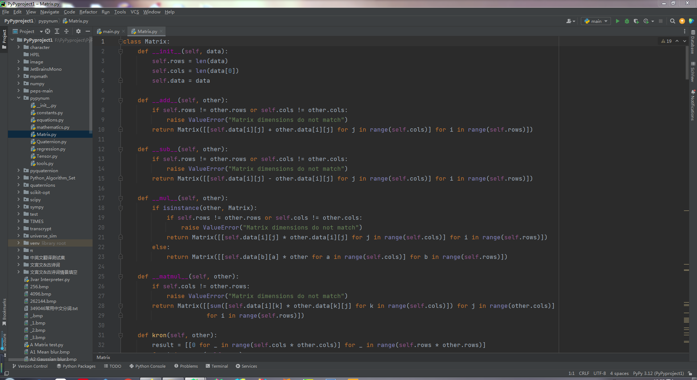

# PyPyNum

#### ----PyPyNum----
#### Version -> 0.7
#### Gitee -> https://www.gitee.com/PythonSJL/PyPyNum

#### 介绍
1.  DIY数学库，类似于numpy、scipy等，专为PyPy解释器制作
2.  不定期更新版本，增加更多实用功能
3.  如需联系，QQ 2261748025 （Py𝙿𝚢𝚝𝚑𝚘𝚗-水晶兰）

"""
PyPyNum
    Geometry
        CLASSES
            Line
            Triangle
    Matrix
        CLASSES
            Matrix
        FUNCTIONS
            eig(matrix)
            hypot(a, b)
            identity(n)
            lu(matrix)
            mat(data)
            qr(matrix)
            svd(matrix)
            tril_indices(n, k=0, m=None)
            zeros(_dimensions)
            zeros_like(_nested_list)
    Quaternion
        CLASSES
            Euler
            Quaternion
        FUNCTIONS
            change(data: Euler | Quaternion) -> Quaternion | Euler
            euler(yaw: int | float = 0, pitch: int | float = 0, roll: int | float = 0) -> Euler
            quat(w: int | float = 0, x: int | float = 0, y: int | float = 0, z: int | float = 0) -> Quaternion
    Tensor
        CLASSES
            Tensor
        FUNCTIONS
            get_shape(_tensor)
            is_valid_tensor(_tensor, _shape)
            ten(data)
            tensor_and_number(tensor, operator, number)
            tolist(_nested_list)
    constants
        DATA
            AMU = 1.6605402e-27
            EB = 1152921504606846976
            G = 6.6743e-11
            GB = 1073741824
            KB = 1024
            MB = 1048576
            NA = 6.02214076e+23
            PB = 1125899906842624
            TB = 1099511627776
            YB = 1208925819614629174706176
            ZB = 1180591620717411303424
            atto = 1e-18
            c = 299792458
            centi = 0.01
            deci = 0.1
            deka = 10.0
            e = 2.718281828459045
            exa = 1e+18
            femto = 1e-15
            gamma = 0.5772156649015329
            giga = 1000000000.0
            h = 6.62607015e-34
            hecto = 100.0
            inf = inf
            kilo = 1000.0
            mega = 1000000.0
            micro = 1e-06
            milli = 0.001
            nan = nan
            nano = 1e-09
            peta = 1000000000000000.0
            phi = 1.618033988749895
            pi = 3.141592653589793
            pico = 1e-12
            qe = 1.60217733e-19
            tera = 1000000000000.0
            yocto = 1e-24
            yotta = 1e+24
            zepto = 1e-21
            zetta = 1e+21
    equations
        FUNCTIONS
            mles = multivariate_linear_equation_system(left: list, right: list) -> None | list
            multivariate_linear_equation_system(left: list, right: list) -> None | list
            pe = polynomial_equation(coefficients: list) -> list
            polynomial_equation(coefficients: list) -> list
    mathematics
        FUNCTIONS
            A = arrangement(n: int, r: int) -> int
            C = combination(n: int, r: int) -> int
            acos(x: int | float) -> int | float
            acosh(x: int | float) -> int | float
            acot(x: int | float) -> int | float
            acoth(x: int | float) -> int | float
            acsc(x: int | float) -> int | float
            acsch(x: int | float) -> int | float
            arrangement(n: int, r: int) -> int
            asec(x: int | float) -> int | float
            asech(x: int | float) -> int | float
            asin(x: int | float) -> int | float
            asinh(x: int | float) -> int | float
            atan(x: int | float) -> int | float
            atanh(x: int | float) -> int | float
            beta(p: int | float, q: int | float) -> int | float
            combination(n: int, r: int) -> int
            cos(x: int | float) -> int | float
            cosh(x: int | float) -> int | float
            cot(x: int | float) -> int | float
            coth(x: int | float) -> int | float
            csc(x: int | float) -> int | float
            csch(x: int | float) -> int | float
            definite_integral(f, x_start: int | float, x_end: int | float, n: int = 10000000) -> float
            derivative(f, x: int | float, h: int | float = 1e-07) -> float
            erf(x: int | float) -> float
            exp(x: int | float) -> int | float
            factorial(n: int) -> int
            freq(data: list | tuple) -> dict
            gamma(alpha: int | float) -> float
            gaussian(x: int | float, _mu: int | float = 0, _sigma: int | float = 1) -> float
            ln(x: int | float) -> int | float
            mean(numbers: list | tuple) -> int | float | complex
            median(numbers: list | tuple) -> int | float | complex
            mode(data: list | tuple) -> <built-in function any>
            pi(i: int, n: int, f) -> int | float | complex
            product(numbers: list | tuple) -> int | float | complex
            ptp(numbers: list | tuple) -> int | float | complex
            root(x: int | float | complex, y: int | float | complex) -> int | float | complex
            sec(x: int | float) -> int | float
            sech(x: int | float) -> int | float
            sigma(i: int, n: int, f) -> int | float | complex
            sigmoid(x: int | float) -> float
            sign(x: int | float) -> int
            sin(x: int | float) -> int | float
            sinh(x: int | float) -> int | float
            std(numbers: list | tuple) -> int | float | complex
            tan(x: int | float) -> int | float
            tanh(x: int | float) -> int | float
            var(numbers: list | tuple) -> int | float | complex
            zeta(alpha: int | float) -> float
    regression
        FUNCTIONS
            covariance_matrix(_x, _y)
            linear_regression(x_values, y_values)
            mean(numbers)
            parabolic_regression(x, y)
            solve_equations(a1, b1, c1, a2, b2, c2)
            variance(numbers)
    tools
        FUNCTIONS
            classify(array: list | tuple) -> dict
            deduplicate(iterable: list | tuple | str) -> list | tuple | str
            frange(start: int | float, stop: int | float, step: float = 1.0) -> list
            linspace(start: int | float, stop: int | float, number: int) -> list
"""

#### 安装教程

1.  下载即可使用，无需其他依赖项

#### 参与贡献

1.  Fork 本仓库
2.  新建 Feat_xxx 分支
3.  提交代码
4.  新建 Pull Request

#### 特技

1.  使用 Readme\_XXX.md 来支持不同的语言，例如 Readme\_en.md, Readme\_zh.md
2.  Gitee 官方博客 [blog.gitee.com](https://blog.gitee.com)
3.  你可以 [https://gitee.com/explore](https://gitee.com/explore) 这个地址来了解 Gitee 上的优秀开源项目
4.  [GVP](https://gitee.com/gvp) 全称是 Gitee 最有价值开源项目，是综合评定出的优秀开源项目
5.  Gitee 官方提供的使用手册 [https://gitee.com/help](https://gitee.com/help)
6.  Gitee 封面人物是一档用来展示 Gitee 会员风采的栏目 [https://gitee.com/gitee-stars/](https://gitee.com/gitee-stars/)
